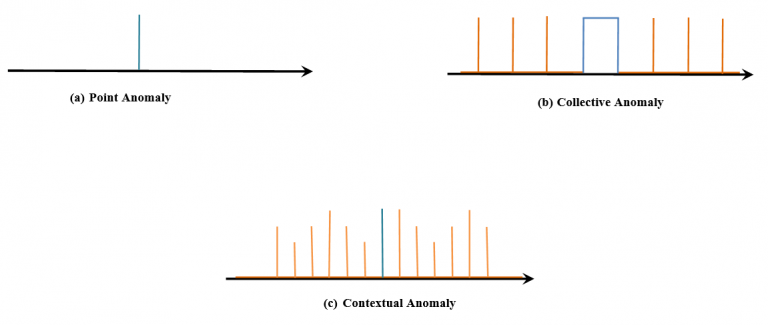
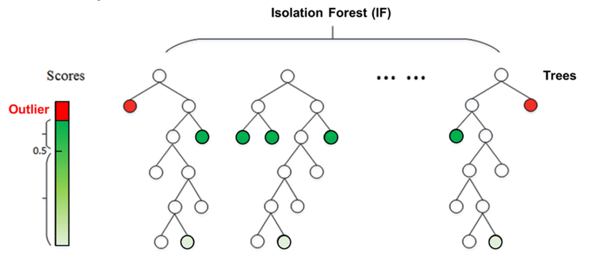
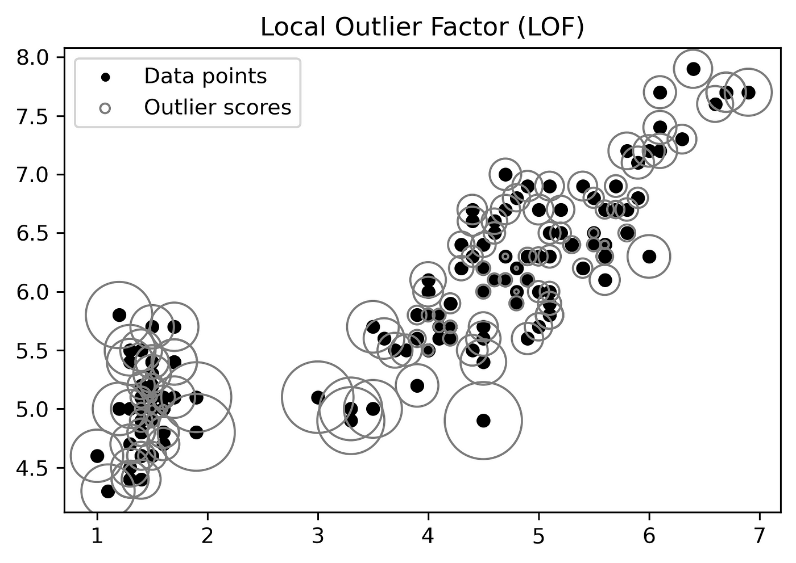
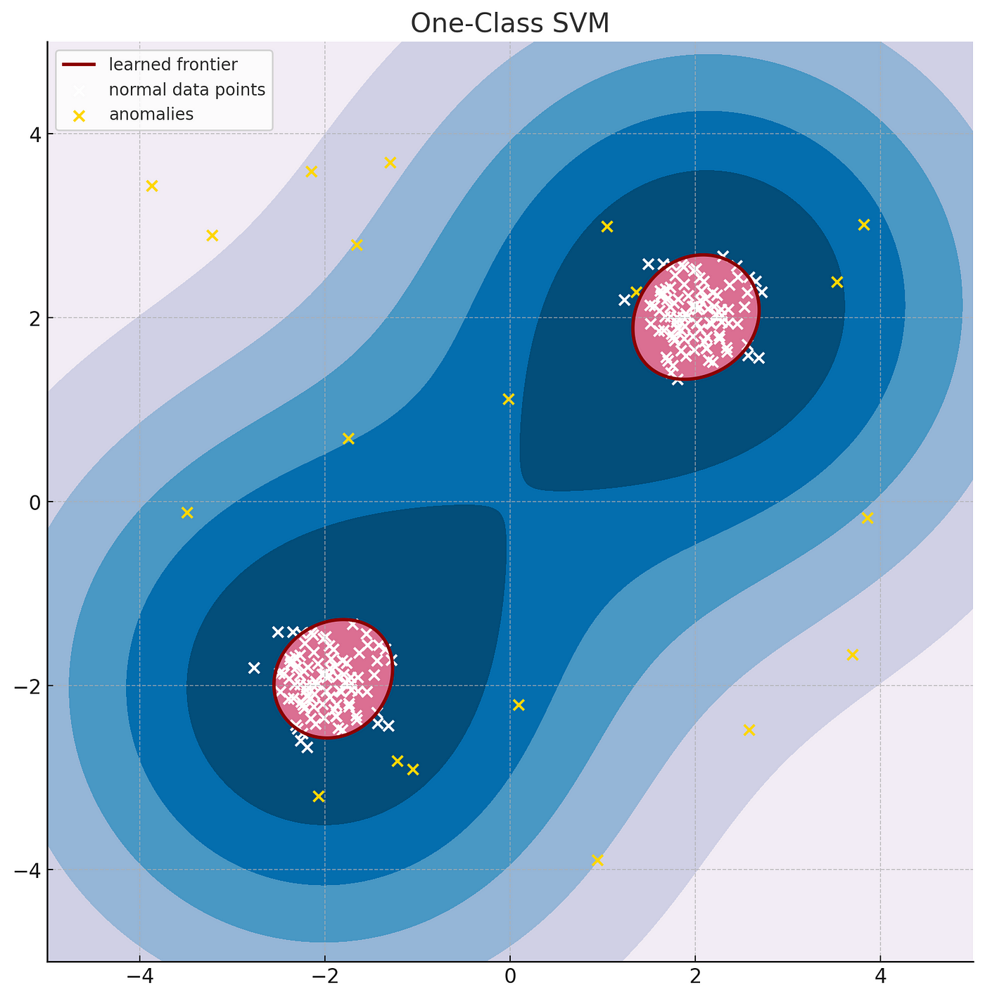
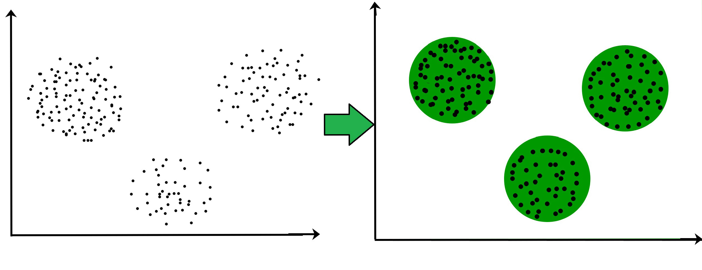
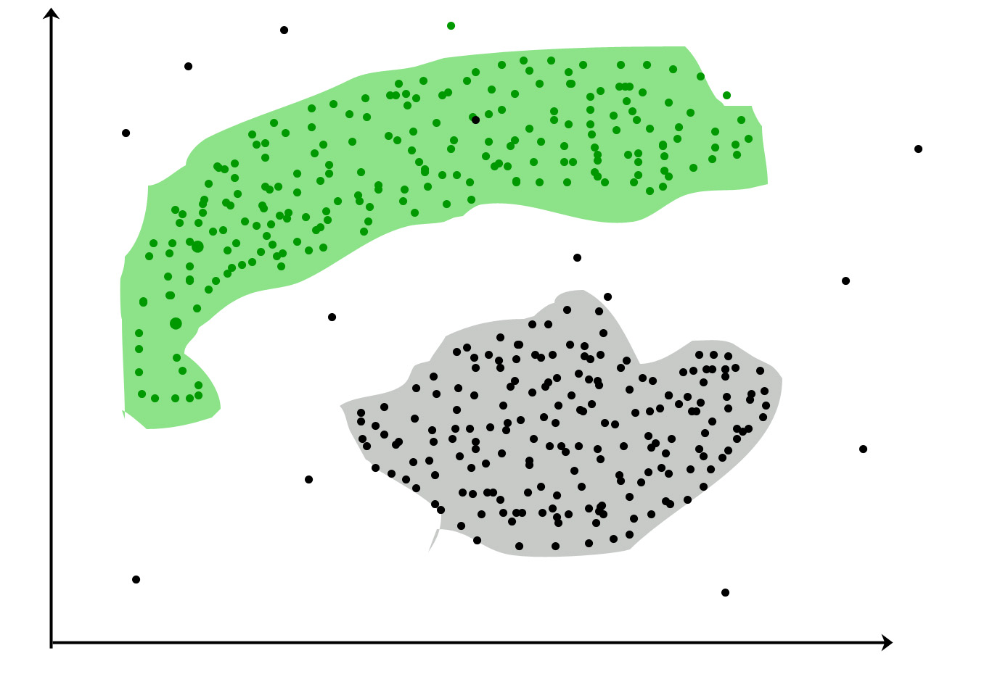
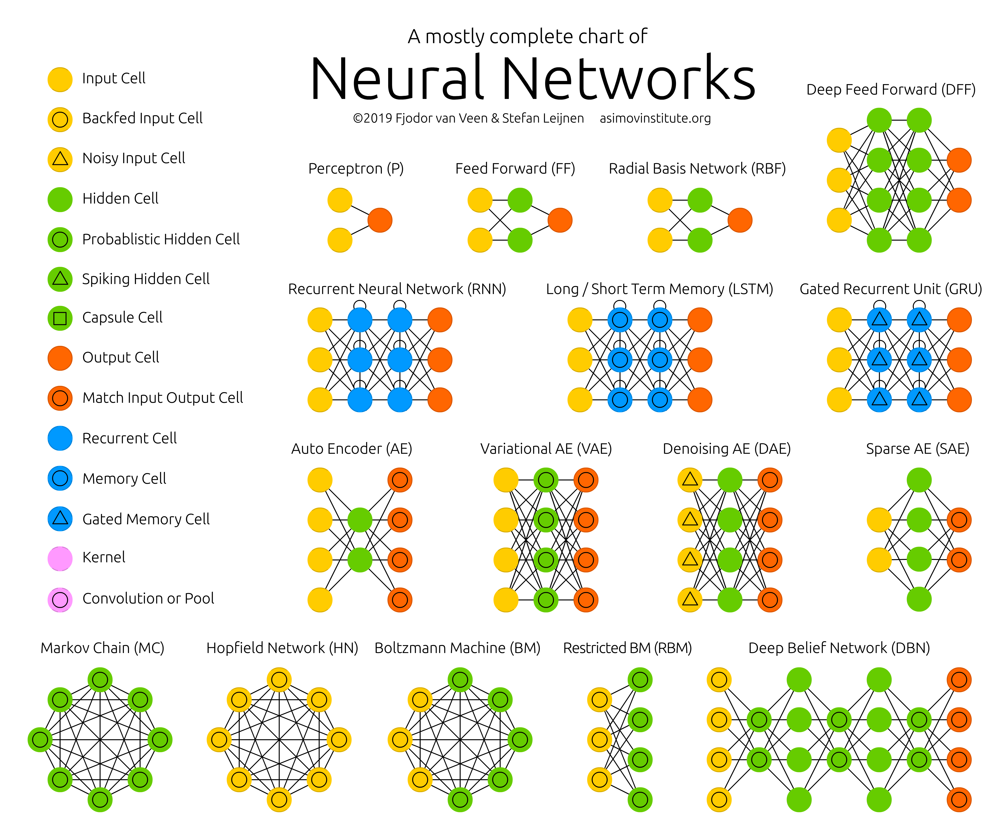
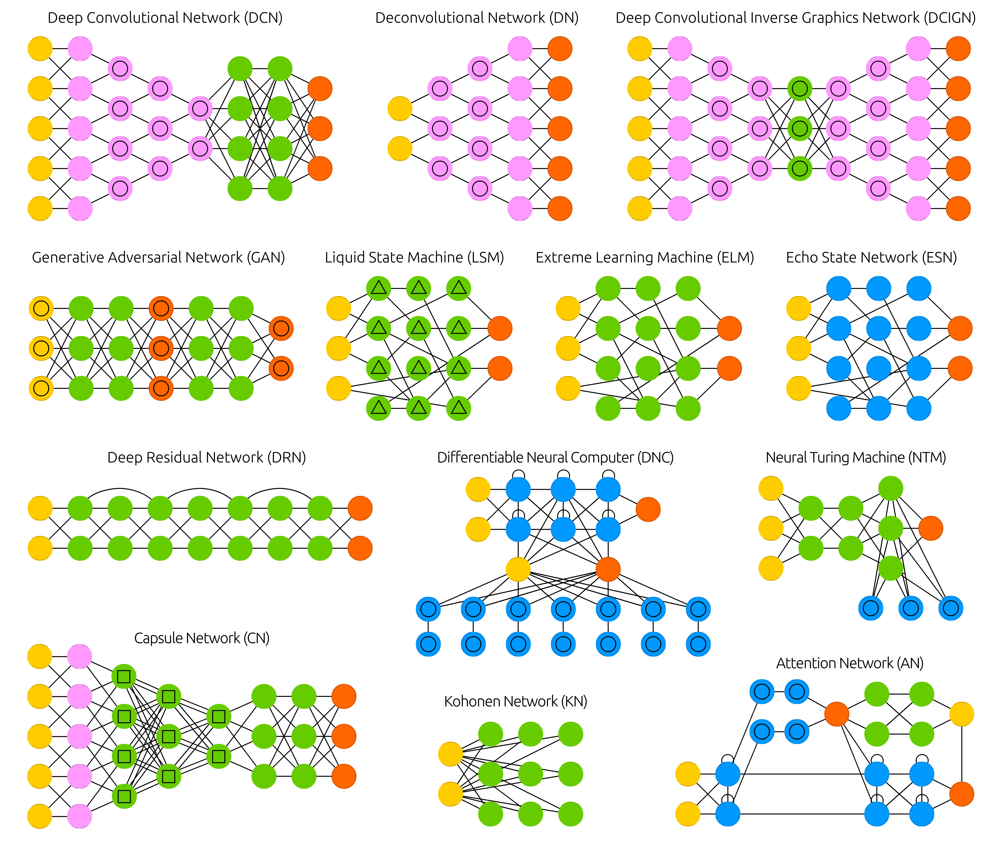
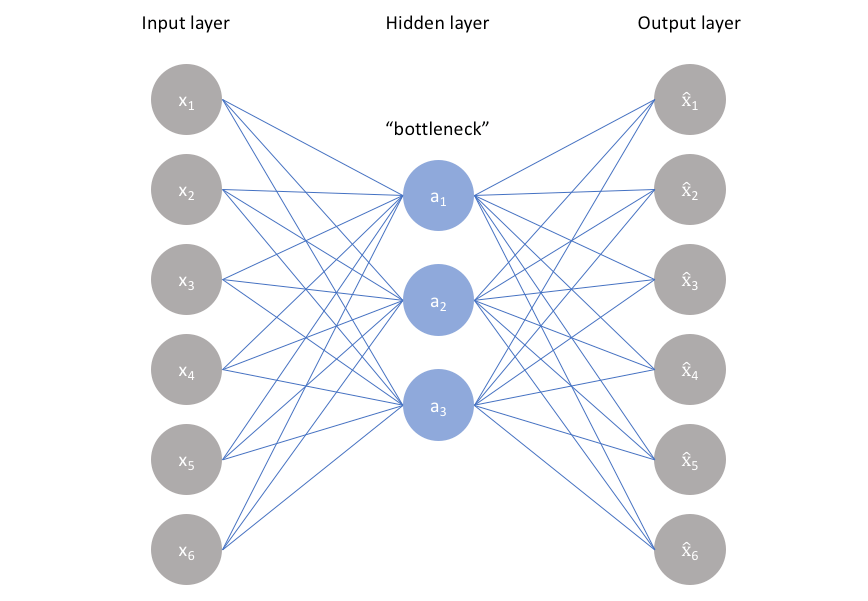
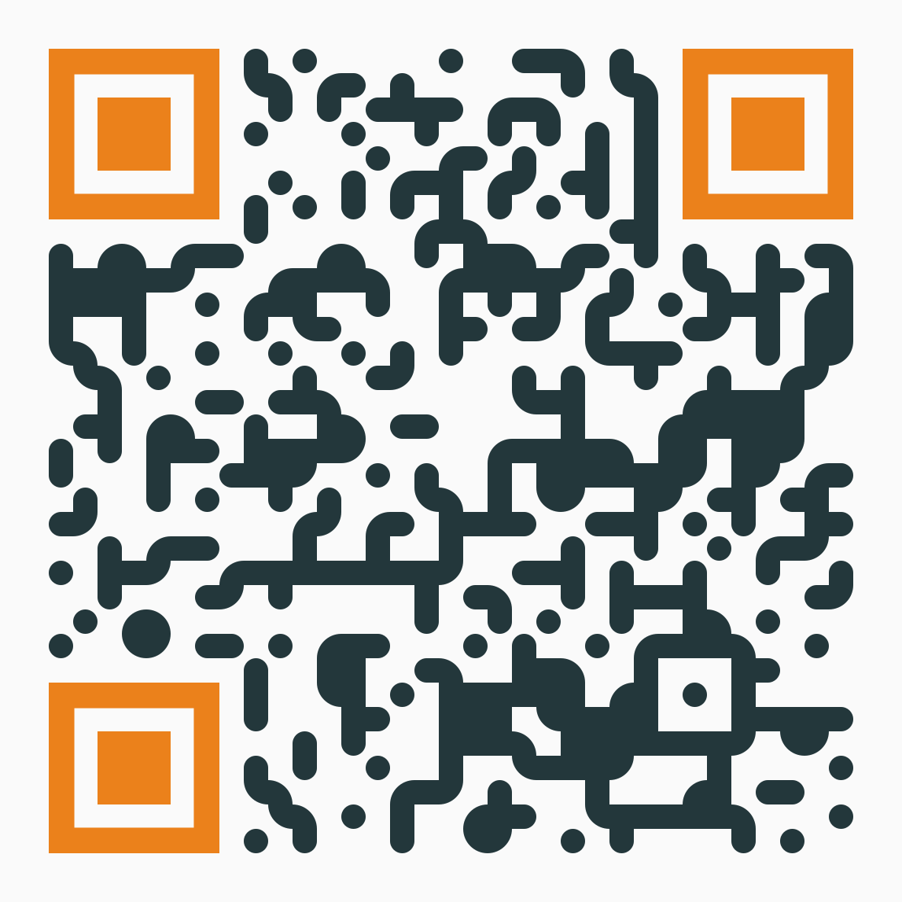

# Context

## Context

It is becoming difficult to identify Cybersecurity attacks. These attacks can originate internally due to malicious intent or negligent actions or externally by malware, target attacks, and APT (Advanced Persistent Threats).

But insider threats are more challenging and can cause more damage than external threats because they have already entered the network. 

These activities present unknown threats and can steal, destroy or alter the assets.

## Context #2

Earlier firewalls, web gateways, and some other intrusion prevention tools are enough to be secure, but now hackers and cyber attackers can bypass approximately all these defense systems. 

Therefore with making these prevention systems strong, it is also equally essential to use detection. So that if hackers get into the network, the system should be able to detect their presence.

## Context #3

## Context #4

**Signature detection** requires knowing what to look for and comparing hashes or other strings to identify a match. Signature detection is a common feature found within antivirus and IPS/IDS products. 

**Behavior detection** looks for malicious or other known behavior characteristics and alarms the SOC when a match is made. An example is identifying port scanning or a file attempting to encrypt your hard drive, which is an indication of ransomware behavior. Antimalware and sandboxes are examples of tools that heavily leverage behavior detection capabilities.

**Anomay detection** it takes into consideration hot topics including big data, threat intelligence, and “zero-day” detection.

# Anomalies

## Anomaly Detection

Anomaly detection, also called outlier detection, is the identification of unexpected events, observations, or items that differ significantly from the norm:

- Anomalies in data occur only very rarely
- The features of data anomalies are significantly different from those of normal instances

## What is an anomaly?

Generally speaking, an **anomaly** is something that differs from a norm: a deviation, an exception. In software engineering, by anomaly we understand a rare occurrence or event that doesn’t fit into the pattern, and, therefore, seems suspicious. Some examples are:

- sudden burst or decrease in activity;
- error in the text logs;
- sudden rapid drop or increase in temperature.

## What is an anomaly? #2

Common reasons for outliers are:

- data preprocessing errors;
- noise;
- fraud;
- attacks.

## Types of Anomalies

Anomalies can be broadly categorized as:

- Point anomalies: A single instance of data is anomalous if it's too far off from the rest. 

- Contextual anomalies: The abnormality is context specific. This type of anomaly is common in time-series data.

- Collective anomalies: A set of data instances collectively helps in detecting anomalies.

## Types of Anomalies #2

# Anomaly Detection - Traditional Methods

## Traditional Methods - IsolationForest

- IsolationForest **isolates** observations by randomly selecting a feature and then randomly selecting a split value between the maximum and minimum values of the selected feature.

- Since recursive partitioning can be represented by a tree structure, the number of splittings required to isolate a sample is equivalent to the path length from the root node to the terminating node.

- This path length, averaged over a forest of such random trees, is a measure of normality and our decision function.

**Random partitioning** produces noticeably shorter paths for anomalies. 
Hence, when a forest of random trees collectively produce shorter path lengths for particular samples, they are highly likely to be **anomalies**.

## Traditional Methods - IsolationForest #2

## Traditional Methods - Local Outlier Factor

- Local Outlier Factor (LOF) measures the local deviation of the density of a given sample with respect to its neighbors. 

- It is local in that the anomaly score depends on how isolated the object is with respect to the surrounding neighborhood.

- More precisely, locality is given by k-nearest neighbors, whose distance is used to estimate the local density. By comparing the local density of a sample to the local densities of its neighbors, one can identify samples that have a substantially lower density than their neighbors. These are considered outliers.

## Traditional Methods - Local Outlier Factor #2

## Traditional Methods - OneClassSVM

- Many approaches are based on the estimation of the density of probability for the normal data. Anomlies corresponds to those samples where the density of probability is "very low".

- Now, SVMs are max-margin methods, i.e. they do not model a probability distribution. Here the idea is to find a function that is positive for regions with high density of points, and negative for small densities.

- One-Class SVM is similar, but instead of using a hyperplane to separate two classes of instances, it uses a hypersphere to encompass all of the instances. Now think of the "margin" as referring to the outside of the hypersphere -- so by "the largest possible margin", we mean "the smallest possible hypersphere".

## Traditional Methods - OneClassSVM #2

# Anomaly Detection - Clustering

## Clustering

Type of **unsupervised learning method**. 
Generally, it is used as a process to find meaningful structure, explanatory underlying processes, generative features, and groupings inherent in a set of examples.

## Clustering Methods

- **Density-Based Methods:** These methods consider the clusters as the dense region having some similarities and differences from the lower dense region of the space. These methods have good accuracy and the ability to merge two clusters.

- **Hierarchical Based Methods:** The clusters formed in this method form a tree-type structure based on the hierarchy. New clusters are formed using the previously formed one.

- **Partitioning Methods:** These methods partition the objects into $k$ clusters and each partition forms one cluster. This method is used to optimize an objective criterion similarity function such as when the distance is a major parameter.

## Clustering - Anomaly Detection

# Anomaly Detection - Auto Encoders

## Neural Networks 

## Neural Networks #2

## Auto Encoders

- Autoencoders are an unsupervised learning technique in which we leverage neural networks for the task of representation learning. 
- Specifically, we'll design a neural network architecture such that we impose a bottleneck in the network which forces a compressed knowledge representation of the original input. 

If the input features were each **independent** of one another, this compression and subsequent reconstruction would be a very **difficult task**.
However, if some sort of structure exists in the data (ie. correlations between input features), this structure can be learned and consequently leveraged when forcing the input through the network's bottleneck.

## Auto Encoders #2

## Auto Encoders #3

- As visualized, we can take an unlabeled dataset and frame it as a supervised learning;
- This network can be trained by minimizing the reconstruction error;
- The bottleneck is a key attribute of our network design; without the presence of an information bottleneck, our network could easily learn to simply memorize the input values by passing these values along through the network.

# Resources

## Resources

[Neural Networks Zoo](https://www.asimovinstitute.org/neural-network-zoo/)

[AutoEncoders](https://www.jeremyjordan.me/autoencoders/)

[Deep Learning for Anomaly Detection](https://ff12.fastforwardlabs.com/)

[Principal components analysis](PCAhttps://www.jeremyjordan.me/principal-components-analysis/)

# Demo

## Demo

